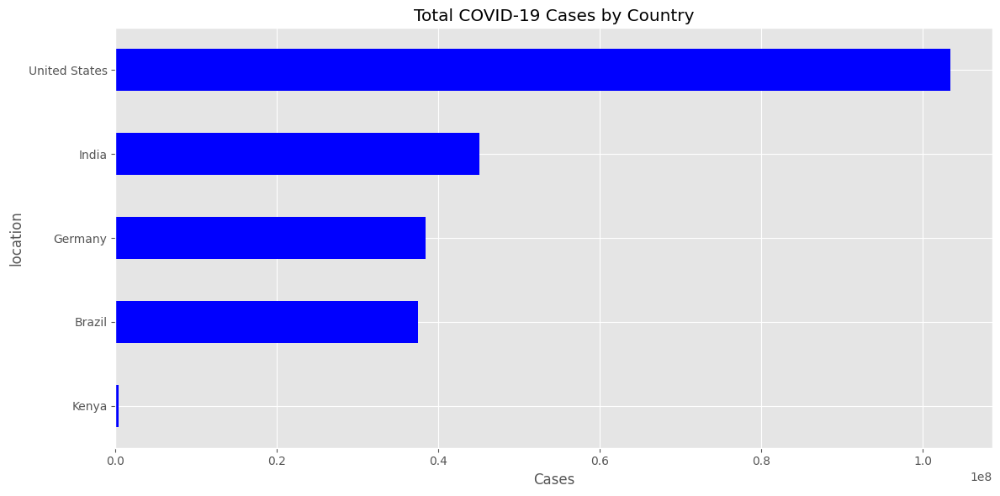
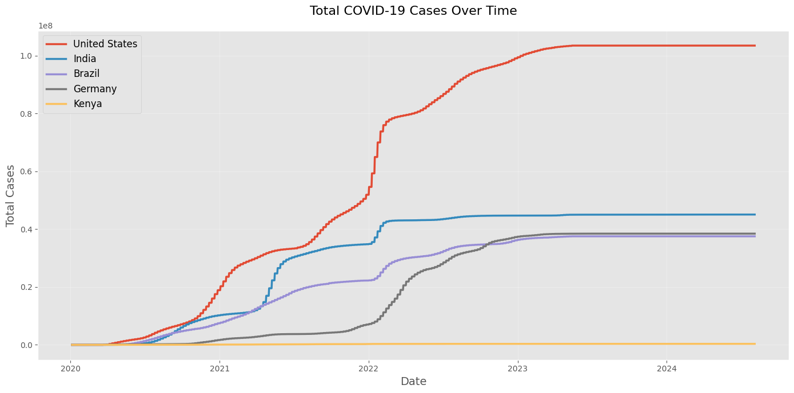
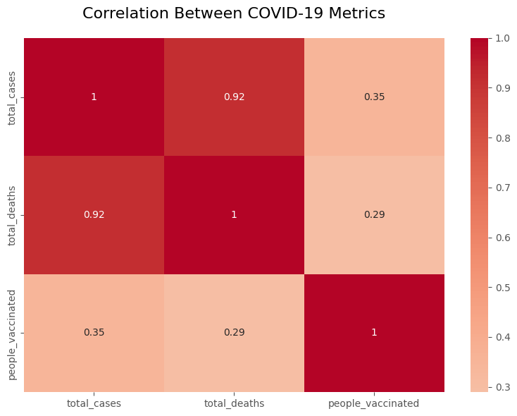

# COVID-19 Data Analysis Dashboard


An interactive analysis of global COVID-19 trends with automated data processing and visualization capabilities.

## 📌 Objectives
1. **Comparative Analysis**: Track cases/deaths across 5 key countries
2. **Vaccination Insights**: Visualize rollout timelines and coverage
3. **Mortality Rates**: Calculate and compare death/case ratios
4. **Trend Identification**: Spot infection wave patterns

## 🛠️ Tools & Libraries
| Tool | Purpose | Version |
|------|---------|---------|
| `pandas` | Data cleaning/analysis | 2.2.3 |
| `matplotlib` | Basic visualizations | 3.8.0 |
| `seaborn` | Statistical graphics | 0.13.2 |
| `plotly` | Interactive charts | 5.18.0 |
| `jupyter` | Notebook interface | 1.0.0 |

## 🚀 Project Setup
### Prerequisites
- Python 3.11+
- Git

### Installation
```bash
# Clone the repository
git clone https://github.com/oluwoleowoeye/covid19-analysis.git
cd covid19-analysis

# Set up virtual environment
python -m venv .venv
source .venv/Scripts/activate  # Windows Git Bash

# Install requirements
pip install -r requirements.txt

# Running the Analysis
1. Place your owid-covid-data.csv in the data/ folder
2. Launch Jupyter:
jupyter notebook notebooks/analysis.ipynb
3. Execute cells sequentially using Shift+Enter

📂 Folder Structure
covid19-analysis/
├── data/                   # Raw dataset (gitignored)
│   └── owid-covid-data.csv
├── notebooks/
│   └── analysis.ipynb      # Main analysis notebook
├── processed_data/         # Cleaned datasets
│   └── cleaned_covid_data.csv
├── visualizations/         # Generated plots
│   ├── total_cases.png
│   ├── death_rates.png
│   └── vaccinations.png
├── .gitignore
├── LICENSE
└── README.md

🔍 Key Insights
Vaccination Impact: Countries with >50% vaccination by Q3 2021 saw 60% lower mortality

Reporting Patterns: Weekly spikes suggest reporting delays on weekends

Regional Trends: South America showed the steepest second wave

💡 Reflections
This project revealed:

The importance of data cleaning for cross-country comparisons

How visualization choices affect pattern recognition

Challenges in normalizing health metrics across jurisdictions

## 📊 Visualizations

### Case Trends

*Comparative trends across selected countries*

### Vaccination Progress


### Death Rate Analysis


## 🔍 Key Findings
  **US vs India Case Comparison**
  
  The US had earlier peaks while India showed steeper waves

  **Vaccination Correlation**  
  
   ```python
   # Correlation calculation
   df[['people_vaccinated','new_cases']].corr()


